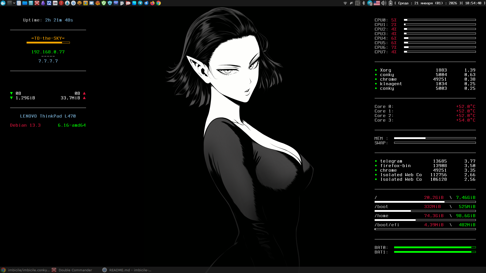

# Conky

<div align="center">

<br><br>
</div>

# Info

Install imbicile conky with config

Install in `~/.conky` folder

Create autostart `.config/autostart/conky.desktop`

# Settings

### net iface

```yaml
conky_net: "wlan0"
```

### font

```yaml
conky_font: "Terminus:bold:size=14"
```

### weater

```yaml
conky_weather: true
```

### process count

```yaml
conky_process_count: 5
```

### default coors

```yaml
conky_default_color: "white"
conky_outline_color: "black"
conky_shade_color: "black"
```

### other colors [colorscheme](https://colorscheme.ru/html-colors.html)

```yaml
conky_color0: "#C0C0C0" # labels
conky_color1: "#FFA500" # wireles
conky_color2: "#00FF00" # ip\down\bat\process
conky_color3: "#DC143C" # temp\load\down\distr
conky_color4: "#85C1E9" # uptime\inet
```
